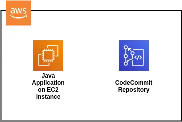
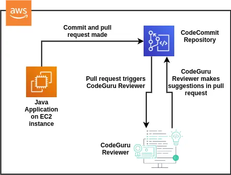
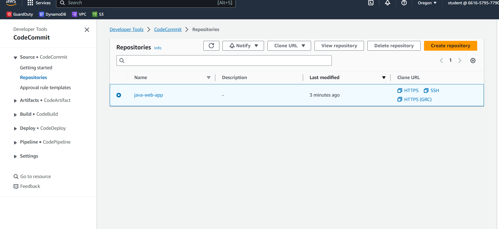
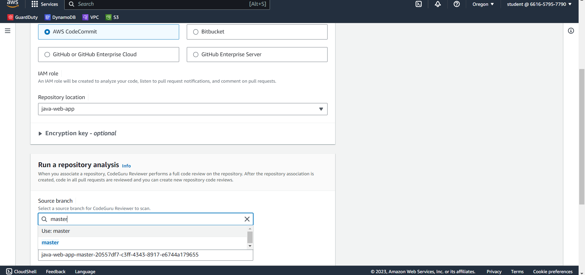
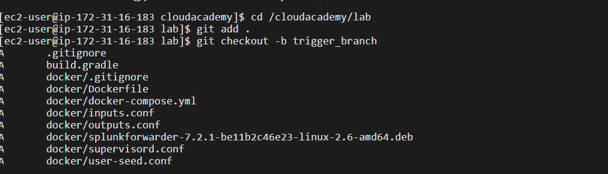
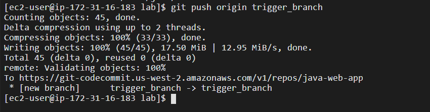
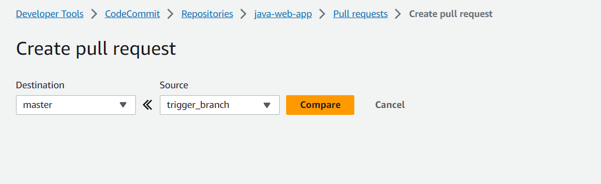

# Automating Code Reviews with Amazon CodeGuru

# Lab Description
When you submit a pull request to a CodeGuru-associated code repository, such as Amazon CodeCommit, CodeGuru will peruse the changes in the pull request and make recommendations based on its own analysis of millions of lines of external code, as comments on your file changes. Additionally, if you deploy CodeGuru as an agent in your application, over time it will make observations and recommendations to help you find and fix code issues such as performance leaks, wasted CPU cycles and more.

# Learning Objectives
1. Be familiar with the basics of Amazon CodeGuru
2. Use CodeGuru to analyze code in a repository

# Prerequisites
Familiarity with the AWS console is helpful but not required
   


Enviornment Before



Enviornment After

## First Step
Setting up the lab and selecting the ``` US West (Oregon) us-west-2 region```

## Second step
Navigating to AmazonCodeCommitrepository tab and checking java-web-app and making sure readme file has been committed to master branch.
and in next step codeguru will analyze the code.



## Third Step

Go to the codeguru repositories and click on ```Associate Repository  and run analysis```

Select AWS Code Commit and give repository location as java-web-app and select source branch as master



## Fourth Step

In this lab step, you'll push all the new code to the nearly-empty CodeCommit repository, to simulate triggering a CodeGuru review.

Navigate to 34.216.63.131:8080 in your browser. 

Note: This is the IP of an EC2 instance that can be found in the EC2 console.

Click the file icon in the top left to open the file tree:

Now open terminal and run following commands:

```cd /cloudacademy/lab
git add .
git checkout -b trigger_branch
git commit -m "trigger a CodeGuru analysis by pushing Java code"
git push origin trigger_branch

``````

This will create a Git commit that includes all the Java files in a branch called trigger_branch, so that you can make a pull request in CodeCommit. Since CodeGuru analyses are triggered by pull requests, this is what will trigger a CodeGuru analysis.






Now come back to codecommit dashboard click on create pull request and set the Destination to master and the source to trigger_branch and click Compare

Type Trigger a CodeGuru Reviewer Analysis into the Title field and click Create pull request



## Fifth Step

Once after creating pull request go to pull requests and click on avaliable pull request and select the changes tab.

In the Go to file filter, enter dockerservlet and click the result to navigate to the file.
You may need to scroll down the page to find the DockerServlet.java file changes. This file is known to have CodeGuru Reviewer comments that usually appear a few minutes after creating the pull request.

Scroll down to line 60 to see an example of a comment from CodeGuru Reviewer.

![Alt text]


 

